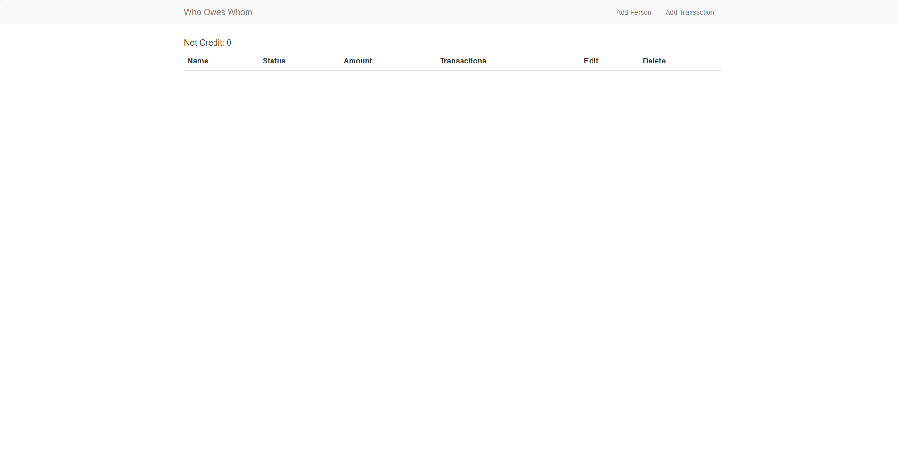
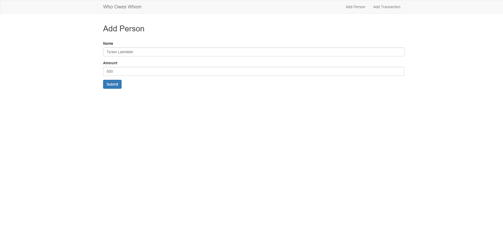
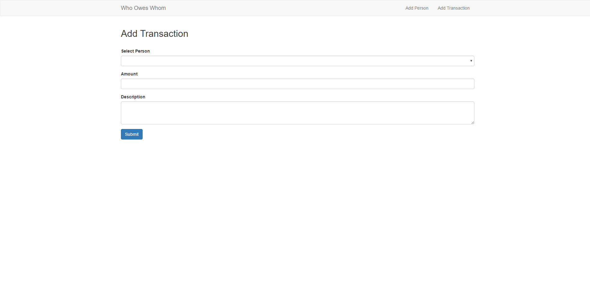
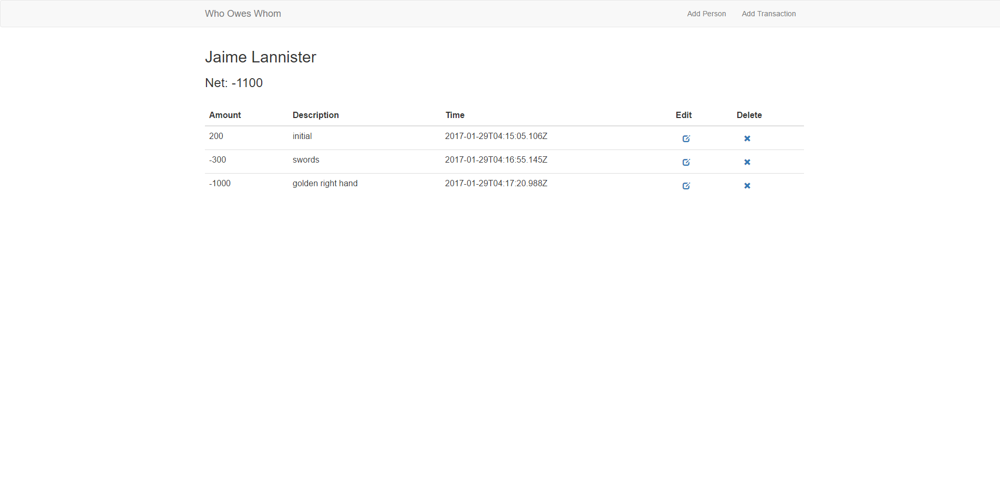
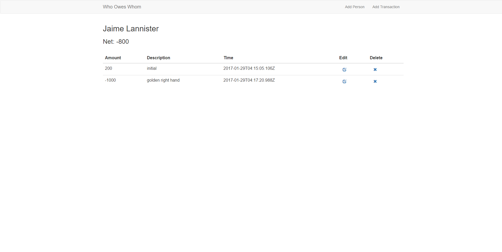
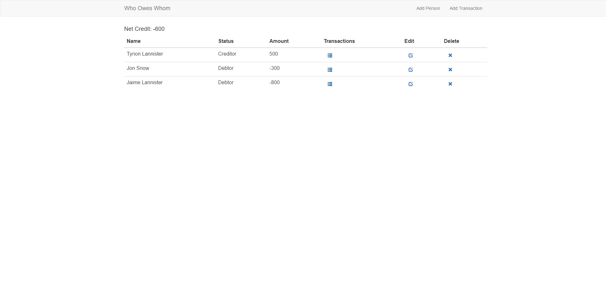

# Who Owes Whom
The purpose of this web application is to keep track of how much you owe and to who along with how much people owe you and who.

The second purpose to this app is so that I can have some practice with RESTful APIs.

## What I use
This application includes an Express RESTful API server with an AngularJS front end.

For the backend:
  - Express
  - MongoDB
  - Mongoose
  - NodeJS

For the frontend:
  - AngularJS
  - Bootstrap

## Helpful links
Brad Traversy's tutorials helped me a lot while learning how to write this app.
Links:
  - https://www.youtube.com/watch?v=eB9Fq9I5ocs
  - https://www.youtube.com/watch?v=qrIvv6OTN2Y
  - https://github.com/bradtraversy/bookstore

Some of the functions he used has been deprecated and are no longer supported but it is still a great tutorial on understanding the concepts nonetheless.

## Usage
Simply clone/download and then run ***npm install***, then run ***npm app***.

# Examples
This is the blank homepage you would start off with when you run the application.

We can add a person or add a transaction to our list by simply clicking the add person/add transaction link at the top right corner.

Here is what it looks like to add someone:

Here is what it looks like to add a transaction:

We can also view the transactions made with a person by clicking on the transaction link on the homepage. The results are shown below:

We can edit/delete the transactions and the net value would change accordingly.
Here we deleted the "swords" transaction from Jaime's list and the net value of him owing me dropped:

Here is what the final homepage would look like with some data in it.

For this web application, if a person owes you, he would have a "debtor" status and the amount will show a negative value. If the person is someone that you owe, that person would have a "creditor" status and the value would be a positive one.
